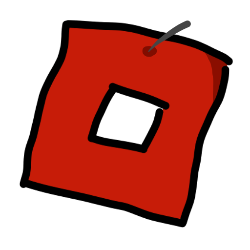

#  ApplejuiceCLI
### ApplejuiceCLI is a light-weight, fast Roblox on Linux bootstrapper that runs with Proton!

You can either use the interface (Soon™) or if you're big brain, use the CLI instead. (**Less bloat! Wow!**)

*Applejuice is a manager to get Roblox to run on Linux using Valve's Proton.*

> [!WARNING]
> Applejuice is still in VERY EARLY development, and may not work as expected.

> [!IMPORTANT]
> For issues you encounter while using Roblox, please refer to [this pinned issue](https://github.com/WaviestBalloon/ApplejuiceCLI/issues/1)!

## Installation

```bash
git clone https://github.com/WaviestBalloon/ApplejuiceCLI.git ; cd ApplejuiceCLI ; chmod +x ./install.sh ; bash ./install.sh
```

## Compiling from source (Read me if running above)

When running the install script, it will compile the binary for you as of now because there are no pre-compiled binaries available yet.

> [!IMPORTANT]
> If compile fails, you might be missing dependencies: 
> - SDL (Monitor Hertz detection, FPS uncapping)
> - libnotify (Desktop notifications)
> - build-essentials/base-devel (Compiling)
> - libssl-dev/openssl (Compiling)
>
> Debian/Ubuntu: 
> ```
> sudo apt-get -y install build-essential libsdl2-dev libnotify libssl-dev
> ```
> Arch: 
> ```
> sudo pacman -Sy base-devel sdl2 libnotify openssl --noconfirm
> ```

### Using the install script

1. Clone this repository.
2. Run `./install.sh`. (You may need to run `chmod +x ./install.sh` first)
3. Launch Roblox via your application launcher or from the website!

### Manual (Not recommended)

1. Clone this repository.
2. Make sure you have Rust and required dependencies installed.
3. Run `cargo build --release` in the repository.
4. Copy the compiled binary from `./target/release/applejuice_cli` to `/usr/local/bin` with the name `applejuicecli`.
5. Run `applejuicecli --init` to initialise the configuration file and directories.
6. Launch Roblox via your application launcher or from the website!
